

    

# Beer Recommender System

A beer recommendation system implementing Collaborative Filtering (CF) and Content-Based (CB) pipelines on the BeerAdvocate and RateBeer datasets. The system offers personalised recommendations, cold-start onboarding, real-time feedback updates, and a full React frontend.

&nbsp; 

## Documentation

You can find all the documentation in the following files:

- [Installation Guide](install.md)
- [Project Summary](summary.md)
- [Modules Description](modules.md)

&nbsp; 

## About

This project is developed for the *Recommender Systems Workshop* at Tel Aviv University.  
More information can be found on the [Workshop Website](https://courses.cs.tau.ac.il/recsys/).

### Authors

- Nitzan Zacharia - zacharia1@mail.tau.ac.il
- Inbal Moryles - inbalmoryles@mail.tau.ac.il
- Moran Khoury - morankhoury@mail.tau.ac.il
- Nadav Ravid - nadavravid1@mail.tau.ac.il
- Dudi Benudiz - dudibenudiz@mail.tau.ac.il

&nbsp; 

## Screenshots
### Home Page
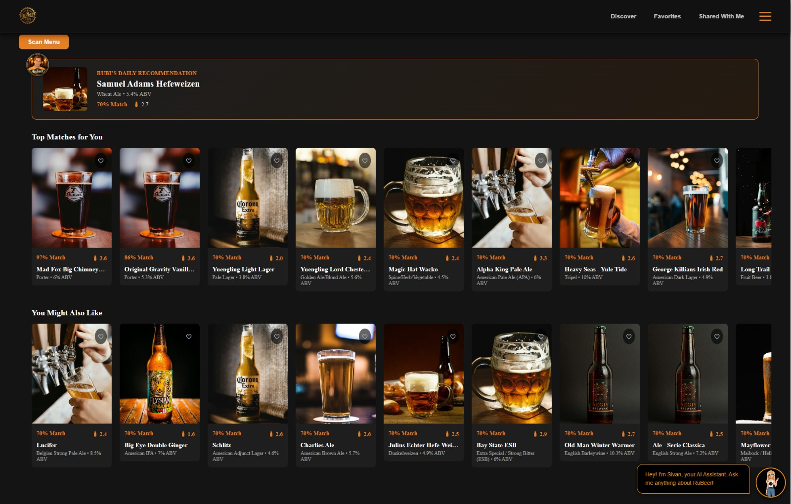

### Beer Card 
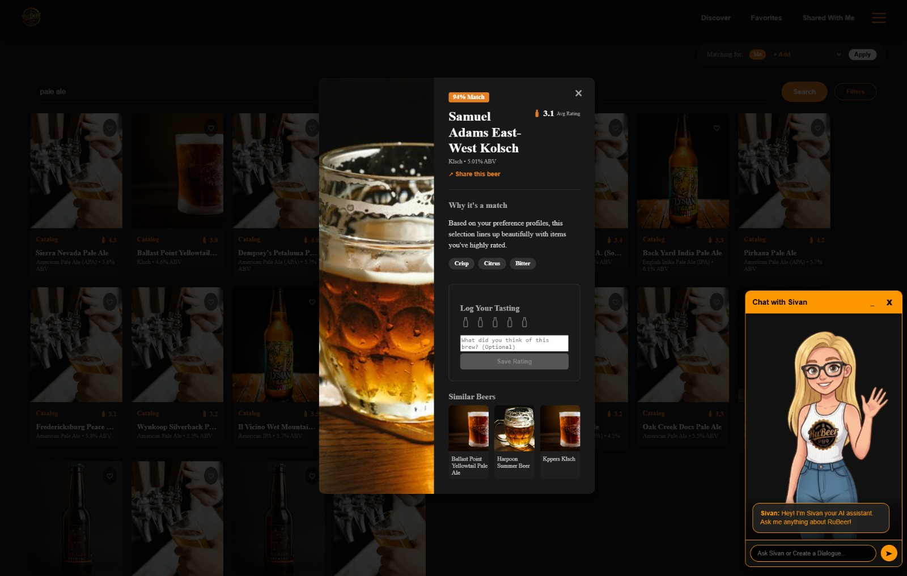

### Explore

### Build a 6-Pack
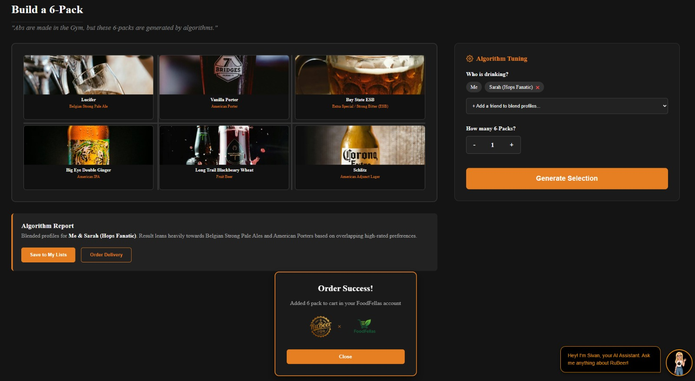

### Share a Beer
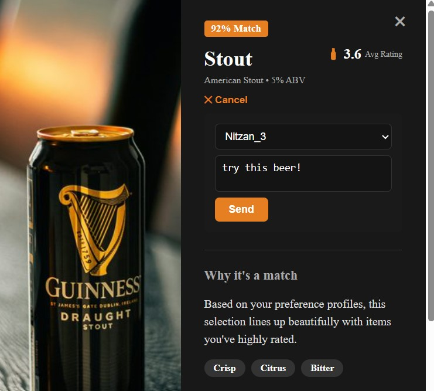

### Beer Lists
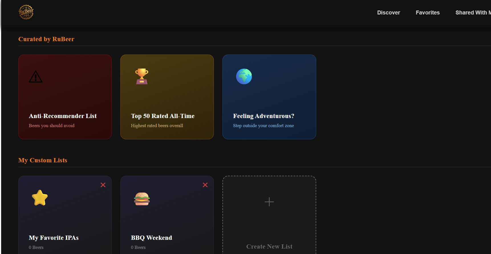

### Favorites
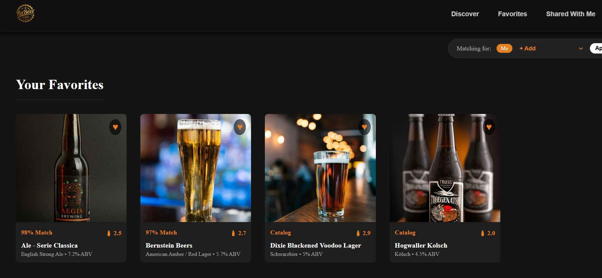

### Shared With Me
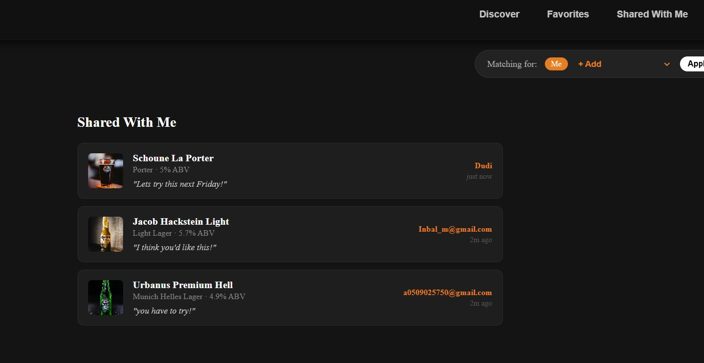

### User Profile
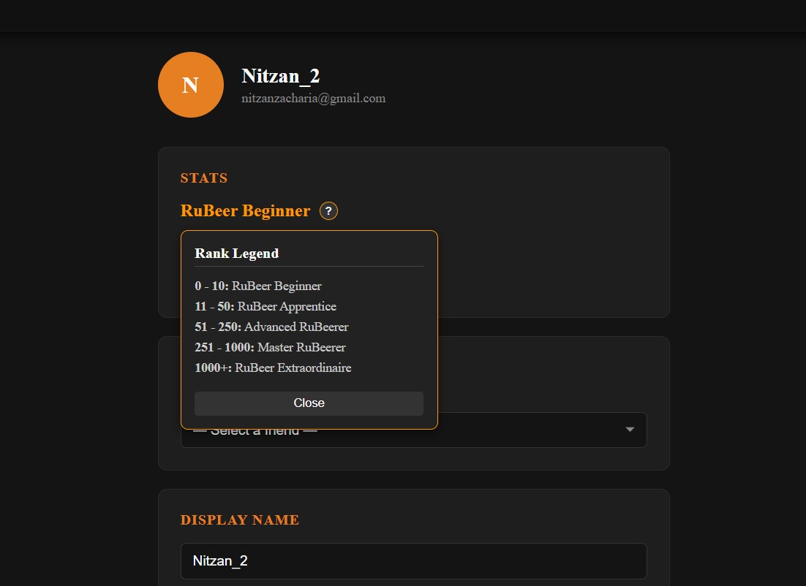

### Friend Compatibility

### Rubi's Daily Recommendation

### Feeling Adventurous

### Anti-Recommender List

### Top 50 Rated All-Time

### Scan Menu
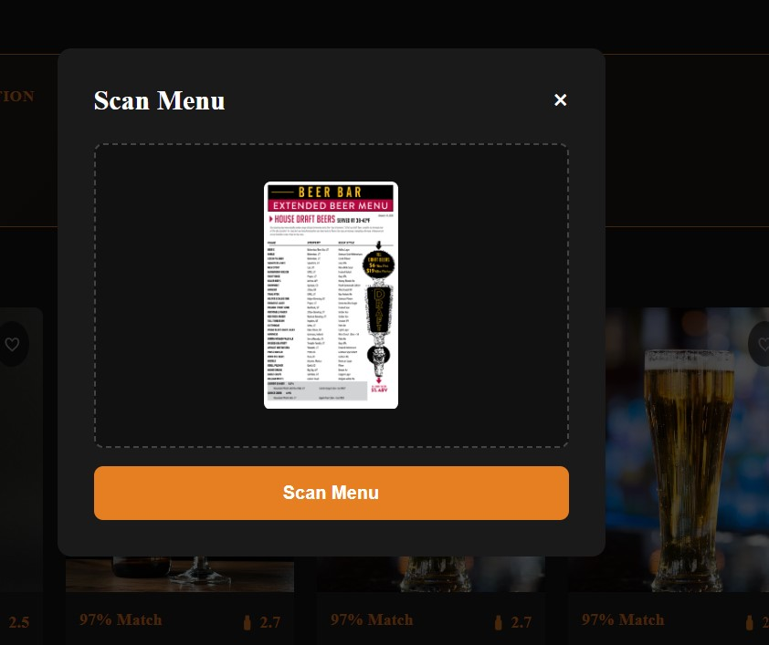
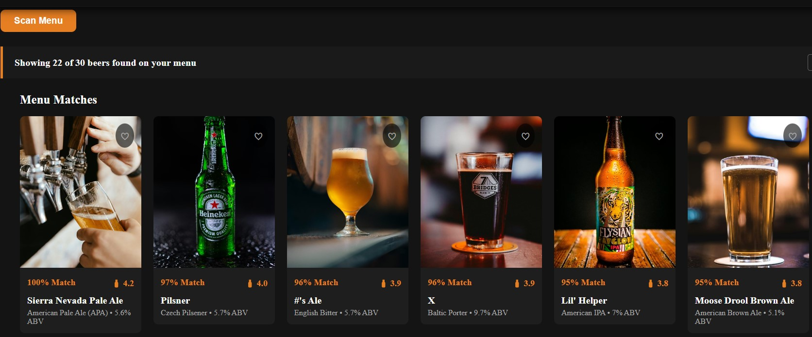

### Stav AI Assistant

### Cold-Start Onboarding

### Cold-Start Onboarding - Method 1

### Cold-Start Onboarding - Method 2
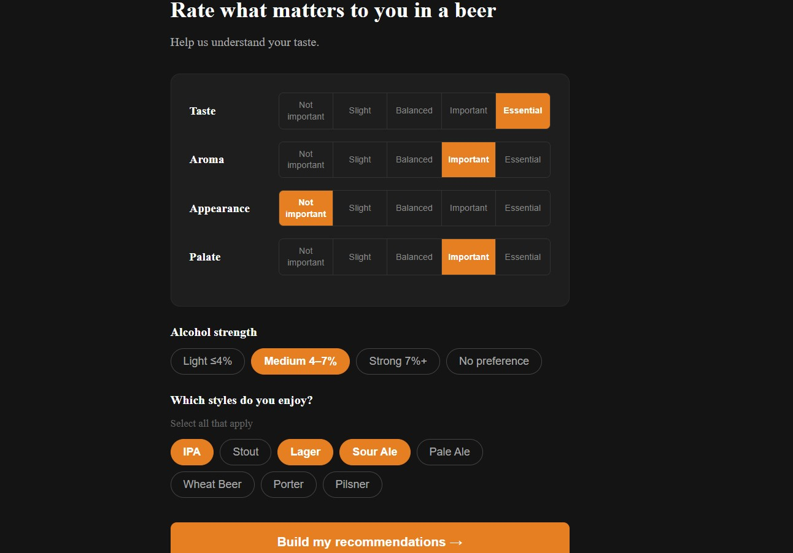